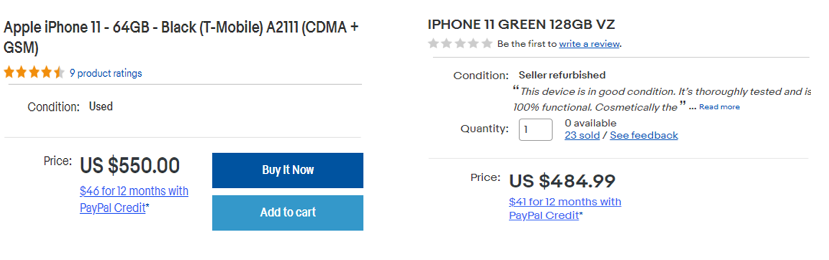
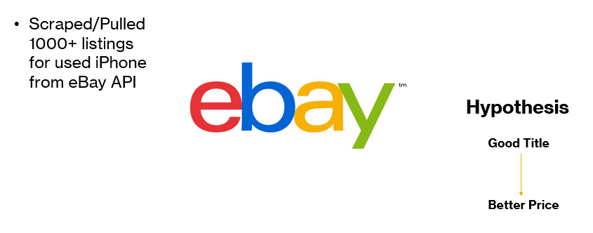
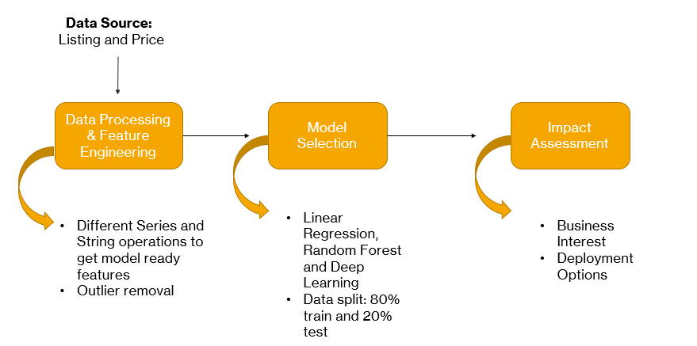
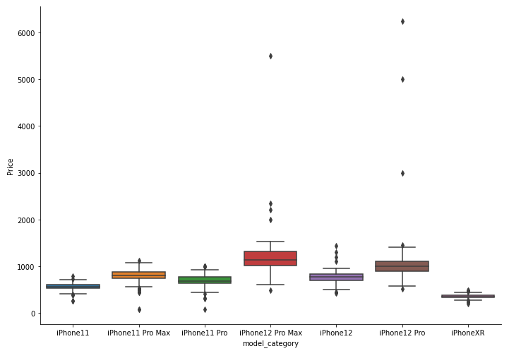
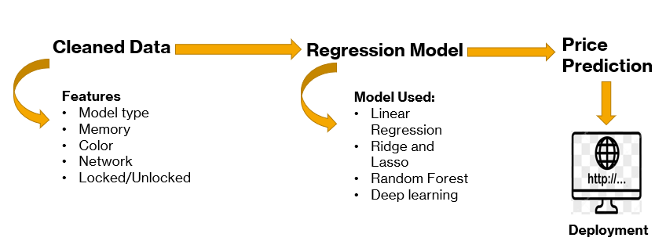

# MobileUp - Price suggestion tool to optimize sales pitch
This project focuses on using raw data and solving niche problem of price suggestion for used iPhone mobiles. For this project we have followed CRISP-DM process.

# CRISP-DM Process:

CRISP-DM is a comprehensive data mining methodology and process model that provides  a complete blueprint for conducting a data mining project. CRISP-DM breaks down the life cycle of a data mining project into six phases.

* Business Understanding: Understanding project objectives and requirements; Data mining problem definition

* Data Understanding: Initial data collection and familiarization; Identify data quality issues.

* Data Preparation: Record and attribute selection; Data cleansing.

* Modeling: Run the data mining tools.

* Evaluation: Determine if results meet business objectives; Identify business issues that should have been addressed earlier.

* Deployment: Put the resulting models into practice; Set up for continuous mining of the data.

# Business understanding:

We want to build an algorithm that automatically suggests the right product prices from the user-inputted listing title of their products and help seller to make his/her
product stand-out. 
* The goal is to solve the problem of suggesting the appropriate price of products to online sellers.
* No latency constraints, because we would like to suggest a highly accurate price to the seller, even if it takes a reasonable amount of time.

# Our Solution:
* Creating app which gives iPhone sellers estimate of Price based on listing title.
* Together with interpretation of price, it also highlights important keywords they can include to optimize listing and get better price.

# Data Source:

You can check code for eBay scraping here.

# Data Pipeline:

For feature engineering :
* Used Pandas Data manipulation tools to create and extract relevant features from listing title.
* Treating outliers and missing values if any.

# Model Category Matters (ofcourse!):

# Modelling:

# Future Work:
* Build flask application and deploy model on server (Heroku, or AWS EC2 instance), so that end users can use it.

# If I had more time:
* Collect data from other websites.
* In this project, I mostly scrapped data for iPhone 11, iPhone 12, and iPhone XR. In future , will extend to other iPhone model and other company product like Samsung , Motorola, etc.

